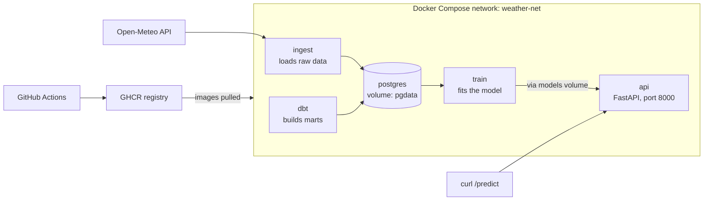

# Docker in 2 Weeks: Study Plan & Project

*As of October 6, 2026*

## How the plan works

You build one project over 14 days, adding a Docker concept each day, so every topic lands in working code. Budget about 1.5–2 hours on weekdays and 3–4 hours on weekend days; days 7 and 14 are catch-up and review.

Each day has three parts:

1. **Learn (30–45 min):** read the concept and run the small drills.
2. **Build (60+ min):** add that concept to the project.
3. **Check (10 min):** answer the self-check questions out loud, as if in an interview.

**Setup before Day 1:**

- [ ] Install Docker Desktop (or Docker Engine on Linux) and confirm `docker run hello-world` works
- [ ] Create a GitHub repo named `weather-pipeline` and clone it
- [ ] Install `dive` (inspects image layers) and `trivy` (scans for vulnerabilities)
- [ ] Have Python 3.11+ and VS Code with the Docker extension ready

## The project: Weather Pipeline

You'll build a small containerized data platform that ingests weather data, models it with dbt, and serves a prediction API. It reuses skills you already have (Python, dbt, SQL) so your attention goes to Docker, and it ends as a portfolio piece that bridges data engineering and ML.

The data comes from the free Open-Meteo API, which needs no key.

| Service | What it does | Docker concepts it teaches |
| --- | --- | --- |
| `ingest` | Python script that pulls hourly weather for a few cities and loads it into Postgres | Dockerfiles, caching, `ENTRYPOINT`, env config |
| `postgres` | The warehouse, with data kept in a named volume | Volumes, healthchecks, official images |
| `dbt` | Transforms raw data into staging and daily-summary marts | Bind mounts, one-off containers, networking |
| `api` | FastAPI service that returns marts and a next-day temperature prediction from a scikit-learn model | Multi-stage builds, non-root users, ports, ML packaging |
| CI | GitHub Actions builds, scans, and pushes images to GitHub Container Registry | Tagging, registries, build cache, security scanning |

By Day 14, `docker compose up` brings the whole stack up from a fresh clone, and `curl localhost:8000/predict?city=boston` returns a prediction.

Ingest loads Postgres, dbt transforms inside it, and train reads its marts to produce the model the API serves.

## Week 1: Core Docker, ending with a working Compose stack

By the end of Week 1, Postgres, ingestion, and dbt run together with one command.

### Day 1: Containers and the core CLI

**Learn:** containers vs. VMs, namespaces and cgroups, images vs. containers, registries, tags vs. digests. Drill `run`, `ps`, `logs`, `exec`, `inspect`, `stop`, `rm`, `images`.

**Build:**

- [ ] Run `postgres:16` with `POSTGRES_PASSWORD` set and `-p 5432:5432`
- [ ] `exec` into it, open `psql`, and create a `raw` schema
- [ ] Write `ingest/ingest.py` on your machine that pulls Open-Meteo data and inserts it into `raw.hourly_weather`
- [ ] Remove the container and confirm the data is gone

**Check:** Why did the data vanish? What does `docker ps -a` show that `docker ps` doesn't?

### Day 2: Your first Dockerfile

**Learn:** `FROM`, `WORKDIR`, `COPY`, `RUN`, `ENV`, `ARG`, `CMD` vs. `ENTRYPOINT`, shell form vs. exec form, `.dockerignore`, the build context.

**Build:**

- [ ] Write `ingest/Dockerfile` on `python:3.12-slim`
- [ ] Add a `.dockerignore` that excludes `.git`, `venv`, and `__pycache__`
- [ ] Read the database host, user, and password from environment variables
- [ ] Build it and run it against Postgres using `host.docker.internal`

**Check:** If `ENTRYPOINT` is `["python", "ingest.py"]`, what does `docker run ingest --city boston` execute?

### Day 3: Layers, caching, and image size

**Learn:** how each instruction creates a layer, cache invalidation order, slim vs. Alpine vs. distroless, `docker history`, BuildKit cache mounts.

**Build:**

- [ ] Note the image size and rebuild time after a one-line code change
- [ ] Copy `requirements.txt` and install dependencies before copying code, then measure again
- [ ] Add `RUN --mount=type=cache,target=/root/.cache/pip`
- [ ] Explore the layers with `dive` and record what's taking up space

**Check:** Why does copying all code before `pip install` make every rebuild slow?

### Day 4: Volumes and bind mounts

**Learn:** the container writable layer, named volumes vs. bind mounts vs. tmpfs, UID and permission issues, backing up a volume.

**Build:**

- [ ] Run Postgres with a named volume `pgdata`, load data, delete the container, recreate it, and confirm the data survived
- [ ] Create a `dbt/` project with staging and daily-summary models
- [ ] Run the official `ghcr.io/dbt-labs/dbt-postgres` image with your project bind-mounted, and run `dbt run`

**Check:** When would you use a bind mount instead of a named volume in production?

### Day 5: Networking the hard way

**Learn:** bridge, host, and none drivers, user-defined networks, DNS by container name, port publishing, why `localhost` inside a container is the container itself.

**Build:**

- [ ] Create a network `weather-net`
- [ ] Run `postgres`, `ingest`, and `dbt` on it with plain `docker run`, connecting by the name `postgres`
- [ ] Remove `-p` from Postgres and confirm the other containers still reach it

**Check:** What's the difference between `EXPOSE` and `-p`?

### Day 6: Docker Compose

**Learn:** services, networks, volumes, `.env` and variable substitution, healthchecks, `depends_on` with `condition: service_healthy`, `docker compose run` for one-off jobs.

**Build:**

- [ ] Replace yesterday's commands with `compose.yaml`
- [ ] Add a Postgres healthcheck using `pg_isready`, and have `ingest` wait for it
- [ ] Move credentials into `.env` and add `.env` to `.gitignore`
- [ ] Confirm `docker compose up -d && docker compose run dbt run` works from a fresh clone

**Check:** Why isn't plain `depends_on` enough to guarantee Postgres is ready?

### Day 7: Catch-up and review

- [ ] Finish anything left from Days 1–6
- [ ] Write a README with setup steps and an architecture sketch
- [ ] Delete everything with `docker compose down -v` and `docker system prune`, then rebuild from scratch
- [ ] Answer all Week 1 self-check questions without notes

## Week 2: Production habits, ML serving, and CI

By the end of Week 2, the stack serves predictions, runs hardened, and ships images through CI.

### Day 8: Multi-stage builds and the ML API

**Learn:** multi-stage builds, builder vs. runtime stages, copying a virtualenv between stages, keeping model weights out of the image vs. baking them in.

**Build:**

- [ ] Write `api/train.py` that reads the daily-summary mart and saves a scikit-learn model to `/models/model.joblib`
- [ ] Add a `train` service in Compose that writes to a shared `models` volume
- [ ] Write a FastAPI app with `/health`, `/summary`, and `/predict`, loading the model from that volume
- [ ] Build the API image in two stages and compare its size to a single-stage build

**Check:** Why is it usually better to mount a model than bake it into the image? When would you bake it in?

### Day 9: Configuration and secrets

**Learn:** twelve-factor config, how `ARG` and `ENV` values leak into `docker history`, Compose secrets, BuildKit secret mounts.

**Build:**

- [ ] Put a fake secret in an `ARG`, build, and find it with `docker history`, then remove it
- [ ] Switch Postgres to `POSTGRES_PASSWORD_FILE` with a Compose secret
- [ ] Have the API and ingest services read the password from `/run/secrets/`

**Check:** Where would these secrets come from on ECS?

### Day 10: Security hardening

**Learn:** running as non-root, read-only root filesystems, dropping Linux capabilities, pinning base images by digest, image scanning, why mounting `docker.sock` equals root on the host.

**Build:**

- [ ] Add a non-root `USER` to the ingest and API images
- [ ] Set `read_only: true` and `cap_drop: [ALL]` on the API, with a `tmpfs` for `/tmp`
- [ ] Scan both images with `trivy image` and fix what you can by updating base images or dependencies

**Check:** What breaks when a container runs read-only, and how do you fix it?

### Day 11: Debugging and operations

**Learn:** `logs`, `stats`, `top`, `events`, `inspect`; exit codes 137 (killed, often out of memory), 143 (SIGTERM), and 1; memory and CPU limits; restart policies; graceful shutdown and `init: true`; log rotation.

**Build:**

- [ ] Set a tiny memory limit on `train`, trigger an out-of-memory kill, and find the evidence in `docker inspect`
- [ ] Add `restart: unless-stopped` and a healthcheck to the API
- [ ] Confirm `docker compose stop api` shuts it down cleanly in under 10 seconds
- [ ] Configure log rotation with `max-size` and `max-file`

**Check:** A container keeps exiting with code 137. Walk through how you'd diagnose it.

### Day 12: Developer workflow

**Learn:** override files, Compose profiles, `docker compose watch`, dev containers.

**Build:**

- [ ] Add `compose.override.yaml` that bind-mounts the API code and runs uvicorn with `--reload`
- [ ] Put `train` and an optional `pgadmin` service behind profiles
- [ ] Try `docker compose watch` as an alternative to the bind mount

**Check:** How do you run the stack without the dev overrides?

### Day 13: CI/CD and registries

**Learn:** image tagging strategy (git SHA and semver), GitHub Container Registry, `docker buildx`, multi-platform builds, the CI build cache, and how Compose services map to ECS task definitions.

**Build:**

- [ ] Add a GitHub Actions workflow that builds the ingest and API images with buildx and the GitHub Actions cache
- [ ] Run a Trivy scan step that fails on critical vulnerabilities
- [ ] Push images to GitHub Container Registry tagged with the commit SHA
- [ ] Build for both `linux/amd64` and `linux/arm64`

**Check:** Why is deploying `:latest` risky?

### Day 14: Capstone review

- [ ] Change `compose.yaml` to pull your images from the registry instead of building them, then run from a fresh clone on a clean Docker install
- [ ] Finish the README: architecture, setup, design decisions, and what you'd change for production
- [ ] Answer every self-check question from both weeks without notes
- [ ] Pin the repo on GitHub and add it to your resume

## Done criteria and stretch goals

You've mastered the core of Docker when you can do all of these without looking anything up:

- [ ] Explain what a container is in terms of namespaces and cgroups
- [ ] Write a cache-friendly, multi-stage, non-root Dockerfile from scratch
- [ ] Choose correctly between a named volume, a bind mount, and tmpfs
- [ ] Debug a container that won't start, can't reach another service, or keeps getting killed
- [ ] Explain how a secret could leak into an image and how to prevent it
- [ ] Build, scan, tag, and push an image from CI

**Stretch goals, if you finish early or want a Week 3:**

- Add Airflow to schedule ingestion, dbt, and training in Compose
- Add `pgvector` and a small RAG endpoint that answers questions about the weather data, to move toward AI engineering
- Deploy the API to ECS Fargate from your registry image
- Run the same stack on a local Kubernetes cluster with `kind`, as the bridge to Kubernetes
