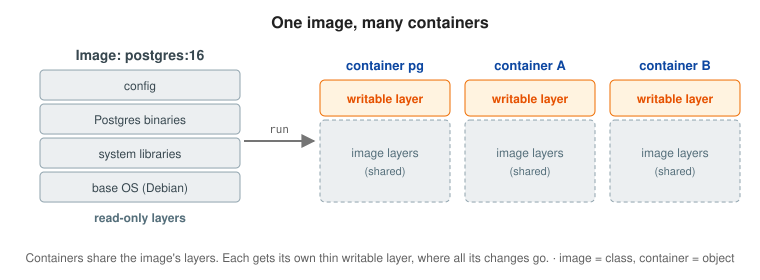
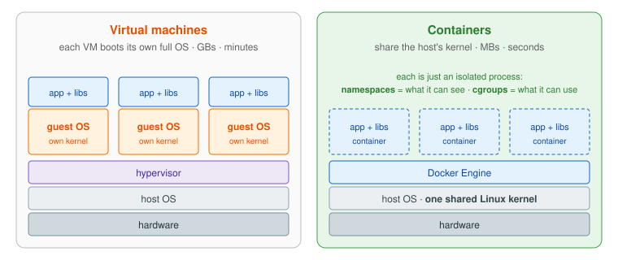
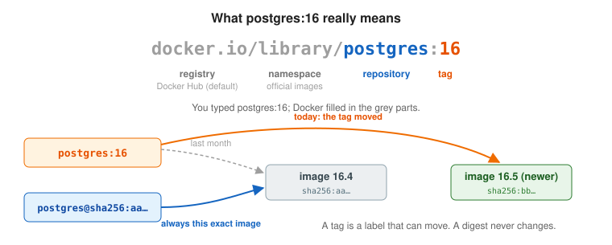
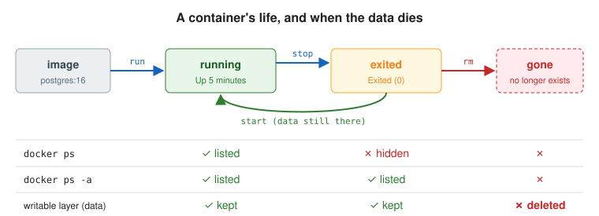
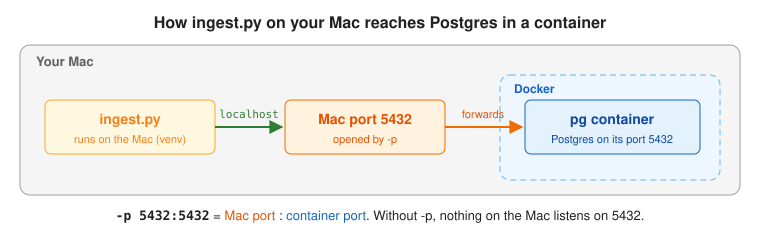

# Day 1: Containers and the core CLI

## Objectives

By the end of the day I can:

1. Explain the difference between an image and a container.
2. Explain how a container differs from a VM, using namespaces and cgroups.
3. Read an image name like `postgres:16` and explain tags vs. digests.
4. Run, inspect, stop, start, and remove containers with the core CLI.
5. Connect from my Mac to a container with port publishing (`-p`).
6. Explain why a container's data disappears when the container is removed.

## 1. Images and containers



- **Image:** a read-only template, built from layers. Like a class.
- **Container:** a running instance of an image. Like an object. One image can run many containers.
- **Writable layer:** each container gets a thin writable layer on top of the read-only image layers. Every file it creates or changes lives there.

> **Real-world analogy:** An **image is a laminated recipe card**: read-only, and any number of cooks can use it. A **container is a dish cooked from it**. Each cook's plate is separate, and whatever you add to your plate (the writable layer) is thrown away when the plate is cleared.

**Why it matters:** this explains almost everything that follows: why containers start fast (the image is already there), why many containers can share one image cheaply, and why data written inside a container is fragile (it's only in that container's writable layer).

## 2. Containers vs. VMs



- A VM runs a whole guest OS with its own kernel. A container is just a process on the host's kernel, isolated by:
  - **Namespaces:** what the process can *see* (its own processes, network, filesystem, hostname).
  - **cgroups:** what it can *use* (CPU, memory, I/O limits).

> **Real-world analogy:** **VMs are separate houses**: each has its own foundation, plumbing and wiring (a full guest OS), so they're expensive and slow to build. **Containers are apartments in one building**: they share the foundation and plumbing (the host kernel), but each has its own locked door (**namespaces**: what you can see) and its own metered electricity (**cgroups**: what you can use).

**Why it matters:** containers are MBs and start in seconds because there's no OS to boot. It's also the classic first interview question ("what is a container, really?"), and the answer is "a process with namespaces and cgroups."

## 3. Image names, tags, and digests



- **Registry:** where images are stored. Docker Hub is the default; GHCR is GitHub's.
- **Image names** are `registry/namespace/repository:tag`. `postgres:16` is short for `docker.io/library/postgres:16`.
- **Tag vs. digest:**
  - A tag (`postgres:16`) is a label that can move to a newer image. `16` means the newest 16.x.
  - A digest (`postgres@sha256:...`) always points to one exact image.

> **Real-world analogy:** A **tag is a job title on an office door**, like "Team Lead": the person behind the door can change. A **digest is a fingerprint**: it identifies exactly one person, forever. `postgres:16` means "whoever is the current 16.x"; `postgres@sha256:...` means "this exact one."

**Why it matters:** pinning a major version (`16`) gets bug fixes without surprise upgrades that could break data files. Digests come back on Day 10 (security) and tags on Day 13 (why deploying `:latest` is risky).

## 4. The container lifecycle



- `docker stop` keeps the writable layer, so `docker start` brings the data back.
- `docker rm` deletes it, so the data is gone. Databases need volumes (Day 4).
- A crashed container disappears from `docker ps` but still shows in `docker ps -a`, with its logs and exit code.

> **Real-world analogy:** `docker stop` is **closing your laptop lid**: everything is still there when you open it (`docker start`). `docker rm` is **wiping and recycling the laptop**. `docker ps` is **who's in the office right now**; `docker ps -a` is **the full staff list**, including people who've gone home.

**Why it matters:** knowing which command destroys what prevents accidental data loss, and `docker ps -a` is the first step in debugging any container that died.

## 5. Port publishing



- `-p HOST:CONTAINER` forwards a port on your machine into the container. Without it, the service is only reachable inside the container's network namespace.

> **Real-world analogy:** Your Mac is a **hotel with one public phone number**. `-p 5432:5432` tells reception: "calls for extension 5432 go to room `pg`." Without it, the room exists, but nobody outside the hotel can call it.

**Why it matters:** it's how anything outside Docker (your Mac, a browser, users) reaches a container. On Day 5 we learn the flip side: containers talking to each other don't need it, and databases shouldn't have it.

## Commands

```bash
# Run a container
docker run -d --name pg -e POSTGRES_PASSWORD=postgres -p 5432:5432 postgres:16
#   -d        run in the background (detached)
#   --name    give it a name to refer to
#   -e        set an environment variable
#   -p        publish a port: host 5432 -> container 5432

# See what's there
docker ps                 # running containers only
docker ps -a              # all containers, including stopped and exited ones
docker images             # images on this machine
docker images postgres    # just the postgres images

# Look inside
docker logs pg            # the container's output
docker logs -f pg         # follow the logs live
docker inspect pg         # full JSON config: env, ports, mounts, state
docker inspect postgres:16 --format '{{.RepoDigests}}'   # the digest a tag points to

# Run a command inside a running container
docker exec -it pg psql -U postgres                      # interactive shell (-it)
docker exec pg psql -U postgres -c 'SELECT 1'            # one-off command, no -it

# Lifecycle
docker stop pg            # stop it (keeps the writable layer)
docker start pg           # start it again, data intact
docker rm pg              # delete it (and its writable layer)
docker rm -f pg           # stop and delete in one step
```

## psql cheat sheet

```sql
CREATE SCHEMA raw;
\dn                       -- list schemas
\dt raw.*                 -- list tables in the raw schema
\d raw.hourly_weather     -- describe a table
\x                        -- toggle vertical output for wide rows
\q                        -- quit

SELECT city, count(*) FROM raw.hourly_weather GROUP BY city;
```

## What I built

- `ingest/ingest.py` pulls 7 days of hourly temperatures for 4 cities from Open-Meteo and loads them into `raw.hourly_weather`.
- Connection settings come from environment variables (`DB_HOST`, `DB_PORT`, `DB_NAME`, `DB_USER`, `DB_PASSWORD`). The defaults point at `localhost:5432`, which works because of `-p 5432:5432`.
- Inserts use `ON CONFLICT ... DO UPDATE` on the `(city, observed_at)` primary key, so reruns are safe (idempotent).
- The script finds Postgres through the published port, not the container name. Names only work as hostnames between containers on the same Docker network (Day 5).

```bash
source venv/bin/activate          # start the virtualenv (deactivate to leave)
python ingest/ingest.py           # load the data
```

## Self-check answers

**Why did the data vanish after removing the container?**

> A container's changes live in its own writable layer on top of the read-only image. `docker rm` deletes that layer, so anything the container wrote is gone. Stopping keeps the data; removing doesn't. That's why stateful services like databases store their data in a volume, which lives outside the container's lifecycle.

**What does `docker ps -a` show that `docker ps` doesn't?**

> `docker ps` lists running containers only. `docker ps -a` includes stopped and exited ones too. It's the first thing I check when a container dies, because the exited container still has its logs and exit code.

## Gotchas

- `localhost` inside a container means the container itself, not your machine.
- A crashed container disappears from `docker ps` but not from `docker ps -a`, and `docker logs` still works on it.
- `postgres` with no tag means `postgres:latest`, which can jump major versions and break data files. Pin at least the major version.
