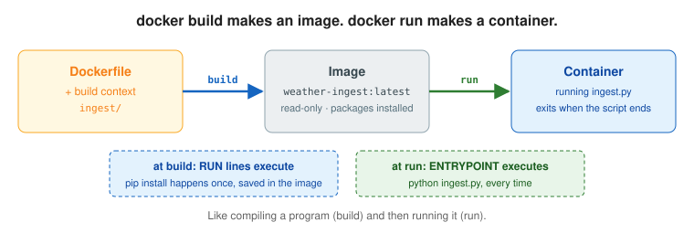
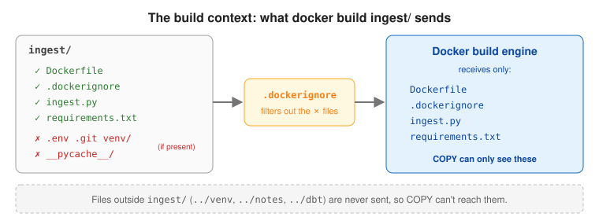
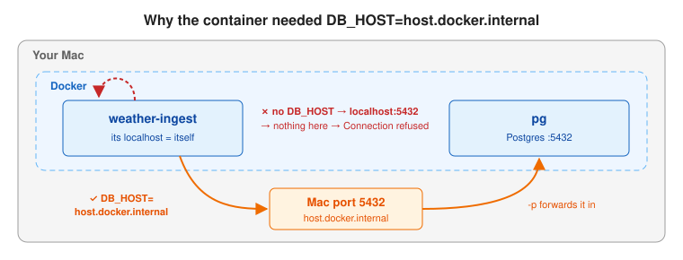
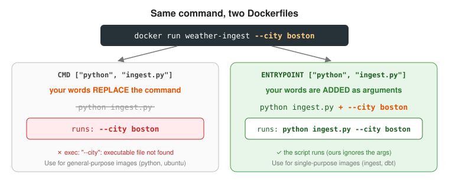
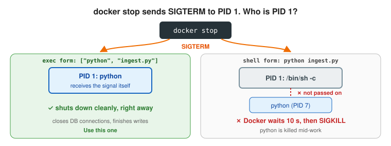

# Day 2: Your first Dockerfile

## Objectives

By the end of the day I can:

1. Write a Dockerfile for a Python script using `FROM`, `WORKDIR`, `COPY`, `RUN`, and `ENTRYPOINT`.
2. Explain the build context and use `.dockerignore`.
3. Explain what happens at build time vs. run time.
4. Explain `CMD` vs. `ENTRYPOINT`, and exec form vs. shell form.
5. Build an image, run it, and connect it to Postgres using `host.docker.internal`.

## 1. Build vs. run



- **Dockerfile:** a recipe for building an image. Instructions run top to bottom; each one creates a layer.
- `docker build` turns a Dockerfile into an **image**. `RUN` lines execute now, and `ENTRYPOINT`/`CMD` are only recorded.
- `docker run` turns an image into a **container**. `ENTRYPOINT`/`CMD` execute now.
- Like compiling vs. running a program: `pip install` happens once at build time and is reused by every container.
- **Image names** come from `docker build -t`, not from the Dockerfile. No tag means `:latest`. The name lives in Docker on your machine, not in the repo.
- **Container names** come from `docker run --name`. Without it, Docker picks a random name like `eager_turing`.

> **Real-world analogy:** `docker build` is **cooking a meal and freezing it**: the slow prep (`RUN pip install`) happens once. `docker run` is **microwaving a portion**: fast, every time. `ENTRYPOINT` is the heating instruction printed on the box; it's only followed when someone eats.

**Why it matters:** packaging the app with its dependencies means it runs the same everywhere, with no venv to set up. Knowing *when* each instruction runs explains why code changes need a rebuild and why containers start in seconds.

## 2. The build context and `.dockerignore`



- **Build context:** the folder passed to `docker build`. It's sent to the build engine, and `COPY` can only reach files inside it.
- **`.dockerignore`:** excludes files from the build context. Keeps builds fast and keeps secrets (`.env`) and junk (`venv`, `.git`) out of the image.

> **Real-world analogy:** The build context is **the one bag you hand to a packer**. They can only pack what's in that bag (`COPY` can't reach outside `ingest/`). `.dockerignore` is your **"do not pack" list**: passports (`.env`) and dirty laundry (`venv`, `__pycache__`) stay out.

**Why it matters:** a forgotten `.env` copied into an image is a leaked secret for anyone who pulls it. A small context also makes builds faster and caching more reliable (Day 3).

## 3. `localhost` and `host.docker.internal`



- **`localhost` inside a container is the container itself**, because each container has its own network namespace. `host.docker.internal` (Docker Desktop) points back to your machine.

> **Real-world analogy:** In an apartment building, **"my home" means a different place for every tenant**: that's `localhost` inside each container. `host.docker.internal` is **"the building's front desk"**: a special address that leads out to the landlord's office (your Mac).

**Why it matters:** this is the most common "works on my machine, fails in Docker" error. Reading connection settings from environment variables means the same code works on the Mac and in a container. It's a temporary fix; Day 5 replaces it with a Docker network.

## Dockerfile instructions

| Instruction | What it does |
| --- | --- |
| `FROM python:3.12-slim` | Base image to start from. `slim` drops compilers and docs. |
| `WORKDIR /app` | Creates `/app` and makes it the working directory for later instructions and the container. |
| `COPY . .` | Copies the build context (minus `.dockerignore`) into the current directory, `/app`. |
| `RUN cmd` | Runs a command at build time and saves the result into the image. |
| `ENV KEY=value` | Sets an environment variable at build time and in every container. |
| `ARG KEY=value` | A variable that exists only during the build (`--build-arg`). |
| `CMD [...]` | Default command. Replaced by any words after the image name in `docker run`. |
| `ENTRYPOINT [...]` | Fixed program. Words after the image name are appended to it as arguments. |

## `CMD` vs. `ENTRYPOINT`



> **Real-world analogy:** `ENTRYPOINT` is a **coffee machine**: the buttons you press ("large, oat milk") are *added*, but it always makes coffee. `CMD` is a **default playlist**: name another song and it *replaces* the whole playlist.

**Why it matters:** it decides whether users can pass flags to your image or accidentally replace what it runs. A classic interview question.

With the Dockerfile having one of these:

| You run | `ENTRYPOINT ["python", "ingest.py"]` | `CMD ["python", "ingest.py"]` |
| --- | --- | --- |
| `docker run img` | `python ingest.py` | `python ingest.py` |
| `docker run img --city boston` | `python ingest.py --city boston` | `--city boston` (error: not a command) |
| `docker run img bash` | `python ingest.py bash` | `bash` |

- Together, `ENTRYPOINT` is the program and `CMD` is default arguments: `ENTRYPOINT ["python", "ingest.py"]` + `CMD ["--city", "all"]`.
- Override `CMD` by typing words after the image name. Override `ENTRYPOINT` with `--entrypoint`.
- Use `ENTRYPOINT` for single-purpose images (like ingest). Use `CMD` alone for general-purpose images (like `python:3.12-slim`, whose `CMD` is `["python3"]`).

## Exec form vs. shell form



> **Real-world analogy:** Exec form is **telling the worker directly** that it's closing time; they tidy up and leave. Shell form is **telling a receptionist who never passes the message on**: the worker keeps going until security (SIGKILL) removes them 10 seconds later, mid-task.

**Why it matters:** with shell form, every `docker stop` takes 10 seconds and kills your app mid-work, which can leave half-written data. Exec form lets it shut down cleanly.

| Form | Example | PID 1 |
| --- | --- | --- |
| Exec (use this) | `ENTRYPOINT ["python", "ingest.py"]` | `python` |
| Shell | `ENTRYPOINT python ingest.py` | `/bin/sh -c ...` |

PID 1 receives `docker stop` (SIGTERM). In shell form the shell usually doesn't pass it on, so Docker waits 10 seconds and force-kills the container.

## What I built

`ingest/.dockerignore`:

```text
.git
venv
__pycache__
.env
```

`ingest/Dockerfile`:

```dockerfile
FROM python:3.12-slim

WORKDIR /app

COPY . .

RUN pip install --no-cache-dir -r requirements.txt

ENTRYPOINT ["python", "ingest.py"]
```

- `COPY . .` before `pip install` is the slow order on purpose. Day 3 fixes it.
- Image size baseline: **241 MB** (53.3 MB compressed).
- `--no-cache-dir` stops pip from keeping downloaded files in the image.

## Commands

```bash
# Build an image from ingest/Dockerfile, with ingest/ as the build context
docker build -t weather-ingest ingest/
#   -t        name (tag) the image; no :tag means :latest
#   ingest/   the build context
#   -f path   use a Dockerfile somewhere other than <context>/Dockerfile

docker images weather-ingest          # check it exists and its size
docker rmi weather-ingest             # delete the image

# Run it against Postgres on the host
docker run --rm --name ingest -e DB_HOST=host.docker.internal weather-ingest
#   --rm      delete the container when it exits (good for one-off jobs)
#   --name    name the container (frees up again thanks to --rm)
#   -e        set an env var inside the container

# Arguments after the image name go to the ENTRYPOINT
docker run --rm -e DB_HOST=host.docker.internal weather-ingest --city boston

# Inspect what the image will run
docker inspect weather-ingest --format '{{.Config.Entrypoint}}'
docker inspect python:3.12-slim --format 'ENTRYPOINT={{.Config.Entrypoint}} CMD={{.Config.Cmd}}'

# Open a shell inside the image instead of running the script
docker run -it --rm --entrypoint bash weather-ingest
```

Without `--rm`, a finished container stays around (`docker ps -a` shows it as `Exited (0)`), and reusing its `--name` fails with `Conflict. The container name ... is already in use`.

## Self-check answers

**If `ENTRYPOINT` is `["python", "ingest.py"]`, what does `docker run weather-ingest --city boston` execute?**

> It runs `python ingest.py --city boston`. Arguments after the image name are appended to the `ENTRYPOINT` as arguments, not used to replace it. Replacing it requires `--entrypoint`. With `CMD`, those words would replace the command entirely.

My first answer was "it fails because entrypoints can't be overridden." Not overridden is right, but it doesn't fail: the args are passed to the script. Our `ingest.py` never reads `sys.argv`, so `--city boston` is silently ignored and all 4 cities load. It would only fail if the script rejected unknown flags (e.g. `argparse`).

**Why did the container fail to connect without `DB_HOST=host.docker.internal`?**

> Each container has its own network namespace, so `localhost` inside it refers to the container itself, not the host. Postgres was running in a separate container, published on the host's port 5432, so I used `host.docker.internal` to reach the host. The better approach is a user-defined network, where containers find each other by name.

The error was `connection to server at "127.0.0.1", port 5432 failed: Connection refused`. On Day 1 the script ran on the Mac, where `localhost` really was the Mac, so it worked.

## Gotchas

- `--rm` deletes the container (not the image, not data in other containers or volumes). Leave it off when debugging a crash, so `docker logs` and the exit code are still there.
- Edited `ingest.py`? Rebuild the image. The image holds a copy of the code from build time.
- `COPY` can't reach files outside the build context (e.g. `../venv`).
- `Running pip as the 'root' user` warning: containers run as root by default. Fixed on Day 10 with `USER`.
- `-p HOST:CONTAINER` numbers don't have to match. With `-p 5421:5432`, the Mac's port 5421 forwards to Postgres's 5432, and ingest needs `-e DB_PORT=5421`, because it connects to the Mac's port, not the container's.
- `host.docker.internal` is a Docker Desktop workaround. Day 5 replaces it with a Docker network and `DB_HOST=postgres`.
