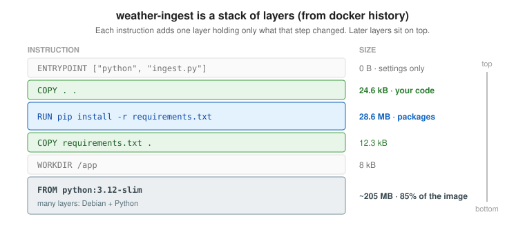
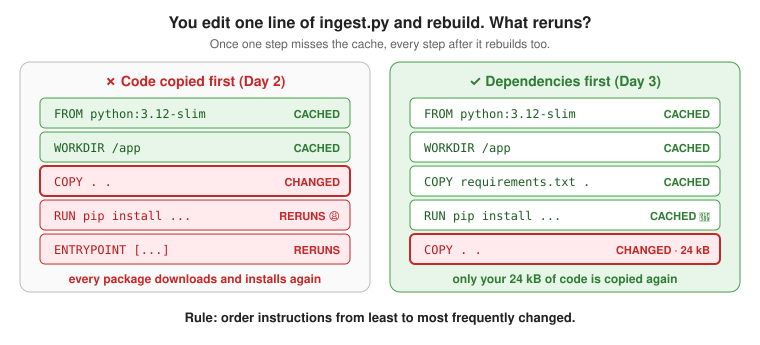
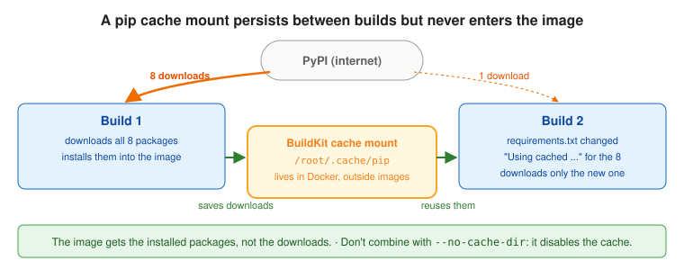
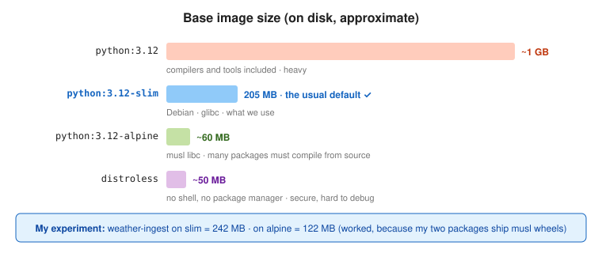

# Day 3: Layers, caching, and image size

## Objectives

By the end of the day I can:

1. Explain how each Dockerfile instruction creates a layer, and read `docker history`.
2. Explain how the build cache decides what to reuse, and why one change rebuilds everything after it.
3. Order a Dockerfile so code changes rebuild in seconds.
4. Use a BuildKit cache mount to speed up dependency changes.
5. Choose a base image (full, slim, Alpine, distroless) and explain the trade-offs.
6. Explore an image's layers with `dive`.

## 1. Layers



- **An image is a stack of layers.** Each `FROM`, `COPY`, and `RUN` adds one, holding only the files that step changed. Settings-only instructions (`WORKDIR`, `ENV`, `ENTRYPOINT`) add 0 B.

> **Real-world analogy:** Layers are **a stack of transparent sheets** on an overhead projector: each sheet adds only what changed, and the picture you see is all of them stacked. The base image is the thick sheet at the bottom; your code is a few pen marks on top.

**Why it matters:** the size of an image is the sum of its layers. In my image the base is 85% of the size and my code is almost nothing, so the base image choice matters far more than code size.

## 2. The build cache and instruction order



- **The build cache.** Before each step Docker asks: have I done this exact step, on top of the exact same layers? If yes, it reuses the layer and shows `CACHED`.
  - `RUN` is keyed on the command text.
  - `COPY` is keyed on the **contents** of the files copied.
- **Once one step misses the cache, every later step rebuilds too.** Each layer sits on top of the previous one.
- **Order from least to most frequently changed:** base image, system packages, dependency list, dependency install, then code.

> **Real-world analogy:** It's a **stack of plates**: to swap a plate in the middle, you must lift off and re-stack every plate above it. So put the plates you change most often (your code) **on top**, and the ones you rarely touch (dependencies) **underneath**.

**Why it matters:** you rebuild many times a day, and CI rebuilds on every commit. Ordering the Dockerfile well turns minutes into seconds. "Why is my Docker build slow?" is one of the most common interview questions, and this is almost always the answer.

## 3. Cache mounts



- **Cache mounts** (`RUN --mount=type=cache,target=...`) keep a tool's cache (e.g. pip downloads) between builds without saving it into the image.

> **Real-world analogy:** The first time you cook, you **buy every ingredient at the store** (PyPI). After that, you keep them in your **pantry** (the cache mount), not in the lunchbox you hand out (the image). Next time a recipe changes, you only shop for the one new ingredient.

**Why it matters:** the instruction-order fix doesn't help when dependencies change. The cache mount does, without making the image bigger.

## The fix

Before (slow: any code edit reinstalls every package):

```dockerfile
COPY . .
RUN pip install --no-cache-dir -r requirements.txt
```

After (code edits reuse the cached install):

```dockerfile
FROM python:3.12-slim

WORKDIR /app

COPY requirements.txt .

RUN --mount=type=cache,target=/root/.cache/pip pip install -r requirements.txt

COPY . .

ENTRYPOINT ["python", "ingest.py"]
```

- Dropped `--no-cache-dir`: it tells pip not to use a cache, which would defeat the mount. The mount lives outside the image, so the cache costs no image space.
- A code-only change now reruns only the final `COPY`. A `requirements.txt` change reruns the install, but pip reuses already-downloaded packages (`Using cached ...`).
- Don't leave a duplicate `RUN pip install` line: it adds a layer that does nothing.

## Base images



> **Real-world analogy:** Packing for a trip: `python:3.12` is a **huge suitcase** with everything; `slim` is a **carry-on** with the essentials. `alpine` is a **backpack**: light, but it uses a different plug standard (musl), so some of your devices (Python wheels) need an adapter you have to build (compiling). Distroless is a **sealed envelope**: nothing extra, and you can't open it to look inside (no shell).

**Why it matters:** smaller images download faster, start faster, and contain fewer packages that can have vulnerabilities (Day 10). But the smallest isn't always best: Alpine can break Python packages.

| Base | Size | Trade-off |
| --- | --- | --- |
| `python:3.12` | ~1 GB | Compilers and tools included; heavy |
| `python:3.12-slim` | ~205 MB | Debian, glibc. **The usual default.** |
| `python:3.12-alpine` | ~60 MB | musl libc. Many packages lack musl wheels, so pip compiles from source: slow, needs compilers, can fail. |
| Distroless | ~50 MB | No shell, no package manager. Secure, hard to debug. |

My experiment with `weather-ingest`:

| Image | Disk usage | Content size (compressed) | OS / C library |
| --- | --- | --- | --- |
| slim | 242 MB | 53.6 MB | Debian 13 / glibc |
| alpine | 122 MB | 29.8 MB | Alpine / musl |

Alpine was half the size and worked, because `requests` and `psycopg[binary]` ship musl wheels. Heavier packages (scikit-learn, pandas, numpy) are where Alpine causes trouble. Stayed on `slim`.

- **Disk usage:** unpacked size on my machine.
- **Content size:** compressed, roughly what gets downloaded on pull.

## Commands

```bash
# Layers of an image: instruction that created each, and its size
docker history weather-ingest

# Time a build. In zsh the line at the very end: "... 8.412 total" = wall-clock seconds
time docker build -t weather-ingest ingest/
time docker build -q -t weather-ingest ingest/     # -q hides the log so the timing is easy to find
# In the build log, "#8 DONE 2.1s" is how long each step took; cached steps show CACHED

# Build a variant under a different tag, keeping the main image
docker build -t weather-ingest:alpine ingest/
docker images weather-ingest
docker rmi weather-ingest:alpine

# Check what OS and C library an image uses
docker run --rm --entrypoint sh weather-ingest -c 'cat /etc/os-release | head -1; ldd --version | head -1'

# Explore layers interactively
brew install dive
dive weather-ingest
```

`dive` controls:

| Key | Action |
| --- | --- |
| ↑ / ↓ | Move between layers or files |
| Tab | Switch between layers pane and files pane |
| Ctrl+U | Show only files the selected layer changed |
| Space | Collapse or expand a folder |
| Ctrl+C | Quit |

The bottom-left shows the **image efficiency** score and **potential wasted space** (files duplicated or deleted across layers). Expect the base image to be most of the size, then the pip install layer; your code is a few KB.

## Self-check answer

**Why does copying all code before `pip install` make every rebuild slow?**

> Docker caches each layer and reuses it only if that step and every step before it are unchanged. `COPY` is keyed on the contents of the files it copies, so with `COPY . .` before `pip install`, any code edit invalidates the copy and forces pip to reinstall everything. The fix is to copy `requirements.txt` first, install dependencies, then copy the code. Code-only changes then reuse the cached dependency layer. In general: order instructions from least to most frequently changed.

My answer had the cause and the fix. Refinement: say "earlier/later" in the Dockerfile rather than "top/below", because in the layer stack later layers sit on top.

## Gotchas

- `--no-cache-dir` and a pip cache mount cancel each other out. Use one or the other.
- Deleting files in a later `RUN` doesn't shrink the image: the earlier layer still contains them. Clean up in the same `RUN` that created the files.
- Building successfully isn't proof an image works. Run it (the Alpine image had to be tested against Postgres).
- `.dockerignore` matters for caching too: without it, changes in `venv/` or `__pycache__/` would invalidate `COPY . .`.
