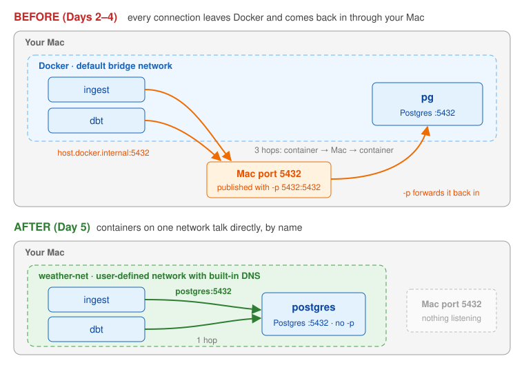
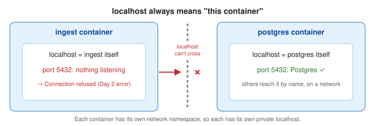
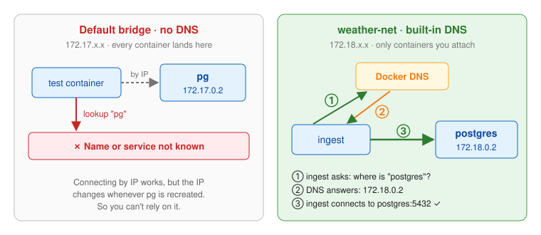
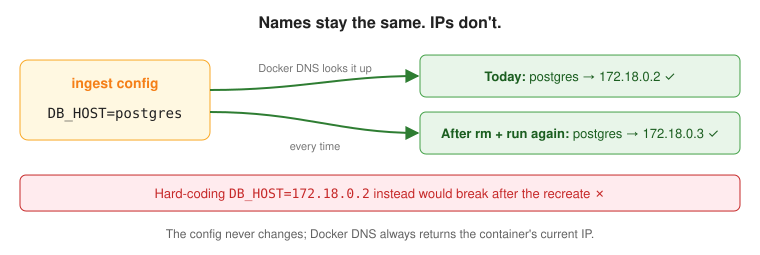
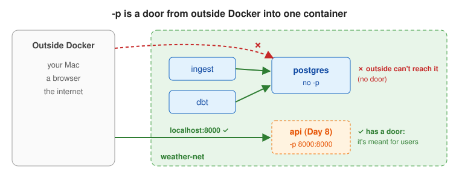
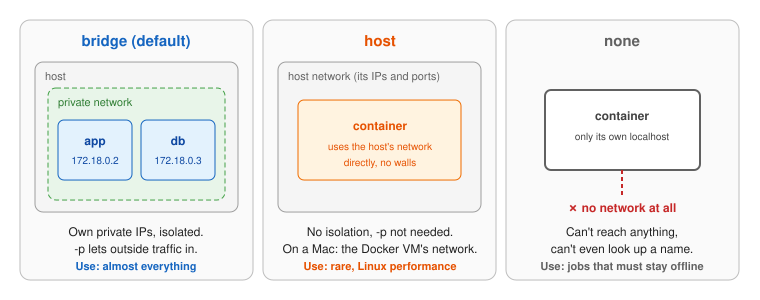
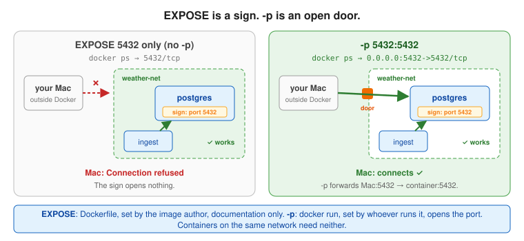
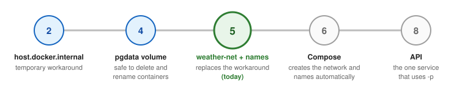

# Day 5: Networking the hard way

## Objectives

By the end of the day I can:

1. Explain how containers talk to each other, and why `localhost` inside a container doesn't reach other containers.
2. Create a user-defined network and connect containers to it.
3. Connect containers by name (`DB_HOST=postgres`) instead of `host.docker.internal` or IP addresses.
4. Run the whole pipeline (Postgres, ingest, dbt) on one network.
5. Remove port publishing from Postgres and explain why the pipeline still works.
6. Choose the right network driver (`bridge`, `host`, `none`).
7. Explain `EXPOSE` vs. `-p`.

## The big picture



- **Before (Days 2–4):** every connection left Docker, went through the Mac's published port, and came back in. Three hops.
- **After (Day 5):** the containers share a private network and talk directly, by name. One hop, and the Mac's port isn't needed at all.

## 1. `localhost` is always the container itself



**What it is:** each container has its own network namespace (Day 1), so it has its own private `localhost`.

**Why it matters:** this is the root cause of the Day 2 error (`connection to 127.0.0.1 ... refused`). To reach another container you need its name on a shared network, never `localhost`.

## 2. User-defined networks and DNS



**What it is:** a private virtual network that I create (`docker network create weather-net`) and attach containers to. Docker runs a built-in DNS server on it.

**Why we use it:** the default `bridge` network has no name lookup, so containers can only find each other by IP. On my own network, they find each other by name.

**Why it matters:** this is how every real multi-container app is wired (app + database, API + cache, Airflow + scheduler). It also isolates groups of containers: my weather containers can't see my Airflow containers unless I put them on the same network.

| | Default `bridge` | User-defined (`weather-net`) |
| --- | --- | --- |
| Find containers by name | ❌ IP only | ✅ Built-in DNS |
| Isolation | ❌ Every container lands here | ✅ Only containers I attach |
| Subnet | `172.17.x.x` | Its own, e.g. `172.18.x.x` |

## 3. Names, not IPs (`DB_HOST=postgres`)



**What it is:** on a user-defined network, a container's `--name` is its hostname.

**Why we use it:** IPs change whenever a container is recreated; names don't. The config says `postgres` and never changes.

**Why it matters:** stable, portable config. The same `DB_HOST=postgres` works on my Mac, a teammate's laptop, or a server. Compose (Day 6) names services and creates the network automatically, so this is exactly how the stack is wired from now on.

That's why the container is renamed from `pg` to `postgres`: its name is now its address.

## 4. Replacing `host.docker.internal`

See **The big picture** above: the orange detour is what goes away.

**What it is:** containers connect to each other directly instead of going out to the Mac and back in.

**Why we use it:** `host.docker.internal` is a Docker Desktop convenience. It isn't available by default on Linux servers and adds a detour through the host.

**Why it matters:** container-to-container traffic should stay inside Docker: faster, works on every platform, and doesn't depend on host ports.

## 5. Removing `-p` from Postgres



**What it is:** running the database without publishing its port to the host.

**Why we use it:** containers on the same network reach each other directly, so `-p` was only ever for the Mac. Once ingest and dbt run in containers, nothing outside Docker needs the database.

**Why it matters:** security. A published database port is reachable by anything that can reach the machine, which on a cloud server can mean the internet. Exposed databases are one of the most common causes of real breaches.

**Rule:** `-p` is a door from the outside world into one container. Publish only what outside users need (the API on Day 8); keep everything else internal.

`docker exec postgres psql ...` still works without `-p`, because `exec` runs a command *inside* the container instead of connecting over the network.

## 6. Network drivers: `bridge`, `host`, `none`



**Why we learn them:** `bridge` is used almost always, but the others have real uses, and choosing one is a security and design decision. Interviewers ask about them to check that you understand isolation, not just commands.

| Driver | What the container gets | Use |
| --- | --- | --- |
| `bridge` | Its own private IP on a virtual network | The default, almost everything |
| `host` | Shares the host's network, no isolation | Rare: performance-sensitive or host-network tools on Linux. On Docker Desktop it means the Linux VM's network, not the Mac's. |
| `none` | No network, only its own `localhost` | Jobs that must not reach anything (e.g. processing sensitive files) |

## 7. `EXPOSE` vs. `-p`

**Why it matters:** both mention ports but do very different things. One of the most commonly confused topics in Docker, and a classic interview question.



- **`EXPOSE`** is a **label** in the Dockerfile. It documents which port the app listens on. It opens nothing.
- **`-p`** is a **real opening** on `docker run`. It forwards a host port into the container.
- Analogy: `EXPOSE` is a sign inside the building saying "deliveries at door 5432"; `-p` unlocks a street door connected to it. Containers on the same network are already inside the building.

What I saw on Day 5:

| | With `-p` (Steps 4–6) | Without `-p` (Step 7) |
| --- | --- | --- |
| `docker ps` ports column | `0.0.0.0:5432->5432/tcp` | `5432/tcp` (the `EXPOSE` label) |
| Mac → Postgres (`nc -zv localhost 5432`) | ✅ | ❌ `Connection refused` |
| ingest and dbt → Postgres (same network) | ✅ | ✅ still works |

| | `EXPOSE` | `-p` |
| --- | --- | --- |
| Where | Dockerfile | `docker run`, or `ports:` in Compose |
| Set by | Image author | Whoever runs the container |
| Does | Documents the port (metadata) | Forwards host port → container port |
| Lets the Mac/browser connect? | ❌ | ✅ |
| Needed between containers on a network? | ❌ | ❌ |

The one thing `EXPOSE` does: `docker run -P` (capital P) publishes every exposed port to a random host port. Handy for quick tests, rarely used.

### How to use `EXPOSE`

Syntax: `EXPOSE 8000` (TCP by default), `EXPOSE 53/udp`, or several: `EXPOSE 8000 9090`. Usually near the end of the Dockerfile, before the startup command. Example (the Day 8 API):

```dockerfile
FROM python:3.12-slim
WORKDIR /app
COPY requirements.txt .
RUN pip install -r requirements.txt
COPY . .
EXPOSE 8000
CMD ["uvicorn", "main:app", "--host", "0.0.0.0", "--port", "8000"]
```

- It must match the port the app actually listens on (`--port 8000`). Docker doesn't check.
- It doesn't make the app listen; the app does that.

```bash
docker inspect weather-api --format '{{.Config.ExposedPorts}}'   # map[8000/tcp:{}]
docker run -d -P --name api weather-api                           # publish exposed ports to random host ports
docker port api                                                   # 8000/tcp -> 0.0.0.0:55123
docker run -d -p 8000:8000 weather-api                            # the real way: works with or without EXPOSE
```

In Compose (Day 6), same idea:

```yaml
services:
  api:
    expose:
      - "8000"        # documentation only, like EXPOSE
    ports:
      - "8000:8000"   # actually publishes it, like -p
```

In this project:

| Service | Listens on a port? | `EXPOSE`? |
| --- | --- | --- |
| ingest | No (client that runs and exits) | Not needed |
| dbt | No (client) | Not needed |
| postgres | Yes, 5432 | Already in the official image |
| api (Day 8) | Yes, 8000 | Add `EXPOSE 8000` |

Rule of thumb: `EXPOSE` every port a service listens on, as documentation. Use `-p` / `ports:` only when something outside Docker needs to reach it.

## How Day 5 fits the plan



| Day | Connection |
| --- | --- |
| 2 | Introduced `host.docker.internal` as a workaround. Day 5 replaces it. |
| 4 | The `pgdata` volume is why the Postgres container can be deleted and renamed without losing data. |
| 6 | Compose creates the network and names automatically. Doing it by hand first shows what Compose does. |
| 8 | The API is the one service that publishes a port, because it's for outside users. |

## What I built

- Network `weather-net` (user-defined bridge, subnet `172.18.x.x`).
- Postgres renamed `pg` → `postgres`, on `weather-net`, **no `-p`**, data kept in `pgdata` (768 rows survived the rename).
- ingest and dbt run on `weather-net` with `DB_HOST=postgres`. `host.docker.internal` is gone.

How `DB_HOST` changed, with the code untouched:

| Where ingest runs | `DB_HOST` | Path to Postgres |
| --- | --- | --- |
| On the Mac (Day 1) | unset → `localhost` | Mac:5432 → `-p` → `pg` |
| In a container (Days 2–4) | `host.docker.internal` | container → Mac:5432 → `-p` → `pg` |
| In a container on `weather-net` (Day 5) | `postgres` | container → `postgres` directly |

Both parts are needed: `--network weather-net` makes the name `postgres` resolvable; `-e DB_HOST=postgres` tells the script which name to use. Missing the network: `could not translate host name "postgres"`. Missing `DB_HOST`: `Connection refused` on `localhost`.

## Commands

```bash
# Networks
docker network ls                          # bridge, host, none + yours
docker network inspect bridge              # containers and IPs on the default bridge
docker network create weather-net          # user-defined bridge, with DNS
docker network inspect weather-net
docker network rm weather-net              # only when no containers are attached

# Name lookup: fails on the default bridge, works on weather-net
docker run --rm python:3.12-slim python -c "import socket; print(socket.gethostbyname('pg'))"
docker run --rm --network weather-net python:3.12-slim \
  python -c "import socket; print(socket.gethostbyname('postgres'))"

# Postgres on the network, no published port
docker run -d --name postgres \
  --network weather-net \
  -e POSTGRES_PASSWORD=postgres \
  -v pgdata:/var/lib/postgresql/data \
  postgres:16

# ingest and dbt, connecting by name
docker run --rm --network weather-net -e DB_HOST=postgres weather-ingest
docker run --rm --platform linux/amd64 \
  --network weather-net \
  -v "$(pwd)/dbt:/usr/app/dbt" \
  -e DB_HOST=postgres \
  ghcr.io/dbt-labs/dbt-postgres:1.9.latest run

# Is anything listening on the Mac's port?
nc -zv localhost 5432                      # Connection refused = not published

# Queries still work: exec runs inside the container, not over the network
docker exec postgres psql -U postgres -c "SELECT count(*) FROM raw.hourly_weather"

# What an image EXPOSEs vs. what's published
docker inspect postgres:16 --format '{{.Config.ExposedPorts}}'
docker ps                                  # 5432/tcp = exposed only; 0.0.0.0:5432->5432/tcp = published
docker port postgres                       # lists published ports (empty here)

# Connect a running container to a network without recreating it
docker network connect weather-net <container>

# No network at all
docker run --rm --network none -e DB_HOST=postgres weather-ingest   # fails: can't resolve
```

## Self-check answer

**What's the difference between `EXPOSE` and `-p`?**

> "`EXPOSE` is documentation in the Dockerfile. It records which port the app listens on, but doesn't open anything. `-p` is a runtime setting that actually publishes the port by forwarding a host port into the container. Containers on the same network can reach each other's ports without either one. So `-p` is only for traffic from outside Docker, and I publish only what external users need."

I didn't know this one at first. The proof was in my own Step 7: after removing `-p`, `docker ps` still showed `5432/tcp` (the image's `EXPOSE`), yet the Mac got `Connection refused`, while ingest and dbt kept working over the network.

## Gotchas

- The default `bridge` has no DNS. Always create a network for containers that need to talk.
- A container's `--name` is its hostname on a user-defined network. Renaming `pg` to `postgres` changed its address.
- `localhost` in a container is the container. Use the other container's name.
- Removing `-p` doesn't stop `docker exec ... psql`: exec isn't a network connection.
- `docker ps` showing `5432/tcp` doesn't mean the port is reachable from the Mac. Look for `0.0.0.0:...->`.
- `docker network rm` fails while containers are attached. Remove or disconnect them first.
- On Docker Desktop, `--network host` means the Linux VM's network, not the Mac's.
