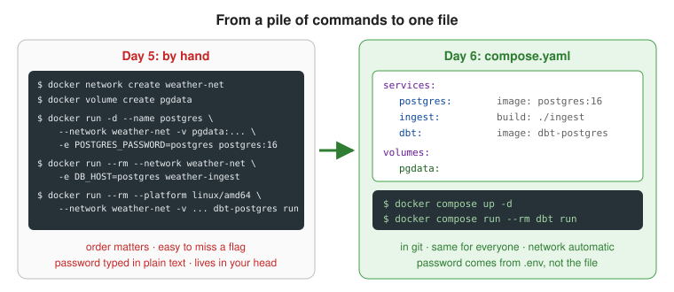
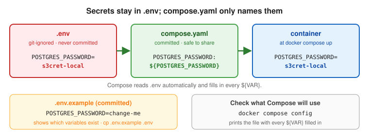
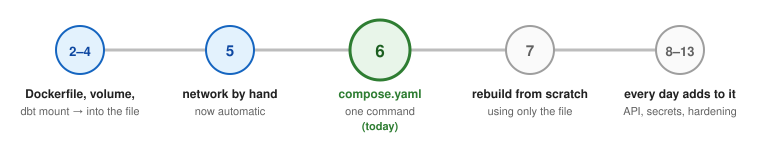

# Day 6: Docker Compose

## Objectives

By the end of the day I can:

1. Describe a multi-container app in `compose.yaml`: services, networks, and volumes.
2. Start, stop, and inspect the whole stack with `docker compose` commands.
3. Move credentials into a `.env` file and use variable substitution.
4. Add a healthcheck to Postgres and make ingest wait until Postgres is actually ready.
5. Run one-off jobs like dbt with `docker compose run`.
6. Bring everything up from a fresh clone with one command.
7. Explain why plain `depends_on` isn't enough.

## The big picture



- **Before (Day 5):** five commands, in the right order, with every flag right, and the password typed in plain text.
- **After (Day 6):** one file in git describes the whole stack. Anyone who clones the repo runs the same two commands.

## 1. `compose.yaml`: the stack in one file


**What it is:** a YAML file listing the services (postgres, ingest, dbt) with everything I was typing by hand.

> **Real-world analogy:** Day 5 was **giving a taxi driver turn-by-turn directions on every trip**. `compose.yaml` is **typing the address into the GPS once**: anyone can make the same trip, the same way, every time.

**Why we use it:** the Day 5 setup lives in my terminal history and my head. One missed `--network` and things break.

**Why it matters:** the file *is* the documentation, it's version-controlled, and it gives everyone the same setup. Almost every real project ships a `compose.yaml` for local development.

The basic shape:

```yaml
services:
  postgres:                     # service name = hostname on the network
    image: postgres:16
    environment:
      POSTGRES_PASSWORD: ${POSTGRES_PASSWORD}
    volumes:
      - pgdata:/var/lib/postgresql/data

  ingest:
    build: ./ingest             # Compose builds ingest/Dockerfile
    environment:
      DB_HOST: postgres

volumes:
  pgdata:                       # named volumes are declared at the top level
```

- `build:` vs. `image:`: `build` points at a folder with a Dockerfile (my code); `image` pulls a ready-made one (postgres, dbt).
- Indentation is meaningful in YAML. Two spaces, never tabs.

## 2. Automatic networking

**What it is:** Compose creates a network for the project automatically (`<project>_default`, where the project is the folder name), and each service's name becomes its hostname.

> **Real-world analogy:** Booking a **meeting room** in a good office: the room comes with **name badges for everyone** already set up. You don't build the room or print the badges yourself.

**Why it matters:** Day 5 did this by hand, so I know exactly what Compose is doing for me. `DB_HOST=postgres` keeps working with no `docker network create`.

## 3. `.env` and variable substitution



**What it is:** a `.env` file next to `compose.yaml` holds values like `POSTGRES_PASSWORD=...`. `compose.yaml` refers to them as `${POSTGRES_PASSWORD}`, and Compose fills them in automatically.

> **Real-world analogy:** `compose.yaml` is a note on the door saying **"use the key from the key box"**: safe to share. `.env` is **the key box that stays at home**. `.env.example` is **a photo of an empty key box labeled "put your key here"**, so others know what they need.

**Why we use it:** passwords shouldn't be in a committed file. `.env` is already in `.gitignore`. A committed `.env.example` shows which variables are needed.

**Why it matters:** committed credentials are one of the most common security mistakes. This is step one; Day 9 goes further with Compose secrets.

- `${VAR:-default}` uses a default if the variable isn't set.
- `docker compose config` prints the final file with everything filled in. Use it to debug substitution.

## 4. Healthchecks and `depends_on`


**What it is:**
- A **healthcheck** is a command Docker runs repeatedly to ask "is this service actually ready?" For Postgres: `pg_isready`.
- **`depends_on`** with **`condition: service_healthy`** makes a service wait until another reports healthy.

> **Real-world analogy:** A **restaurant unlocks its doors (started) while the kitchen is still warming up**. With plain `depends_on`, guests rush in the moment the door opens, and their orders fail. A healthcheck is the **host asking the kitchen "ready?"** before seating anyone (`service_healthy`). `service_completed_successfully` is a **relay race**: the next runner only starts once the baton is handed over.

**Why we use it:** I've already seen `the database system is starting up` when querying too soon. A started container isn't a ready application.

**Why it matters:** race conditions at startup are a classic cause of flaky systems: it works on a fast laptop and fails in CI. It's also today's interview question.

The syntax:

```yaml
services:
  postgres:
    healthcheck:
      test: ["CMD-SHELL", "pg_isready -U postgres"]
      interval: 5s      # how often to check
      timeout: 5s       # how long one check may take
      retries: 5        # failures before "unhealthy"

  ingest:
    depends_on:
      postgres:
        condition: service_healthy
```

| `condition:` | Waits until the other service... |
| --- | --- |
| `service_started` (what plain `depends_on` means) | has started |
| `service_healthy` | passes its healthcheck |
| `service_completed_successfully` | has run and exited with code 0 (e.g. dbt after ingest) |

`docker compose ps` shows health in the status column: `Up (health: starting)`, then `Up (healthy)`.

## 5. Services vs. one-off jobs


**What it is:** `docker compose up` starts the services defined in the file. `docker compose run <service> <args>` runs one container from a service's definition, once.

> **Real-world analogy:** Postgres is a **shop that's open all day** (a service). ingest and dbt are **deliveries**: they arrive, unload, and leave (jobs). `docker compose run` is **ordering one delivery on demand**. `down` is **closing the shop for the night** (the stock stays); `down -v` is **closing and throwing out all the stock**.

**Why we use it:** dbt isn't something that runs all the time; I run it when I need it. `docker compose run --rm dbt run` replaces the long Day 5 dbt command, and the `run` at the end goes to dbt's `ENTRYPOINT`, just like before.

**Why it matters:** separating long-running services from jobs is the same model schedulers like Airflow use (a Week 3 stretch goal).

## Compose commands

```bash
docker compose up -d              # build if needed, create network/volumes, start everything (detached)
docker compose up -d --build      # force a rebuild of build: services first
docker compose ps                 # status of this project's containers, including health
docker compose ps -a              # include exited ones (like ingest after it finishes)
docker compose logs -f ingest     # follow one service's logs
docker compose run --rm dbt run   # one-off job using the dbt service's settings
docker compose exec postgres psql -U postgres   # run a command in a running service
docker compose config             # the final file with .env values filled in
docker compose build              # build images only
docker compose stop               # stop, keep containers
docker compose down               # stop and remove containers + network (volumes kept)
docker compose down -v            # ...and delete volumes: data gone
```

All of these must be run from the folder containing `compose.yaml` (or use `-f path/to/compose.yaml`).

## How Day 6 fits the plan



| Day | Connection |
| --- | --- |
| 2–3 | Compose builds `ingest/Dockerfile` itself with `build: ./ingest`. |
| 4 | The `pgdata` volume and the dbt bind mount move into the file. |
| 5 | The network and names I created by hand now happen automatically. |
| 7 | Review day: delete everything and rebuild from scratch using only `compose.yaml`. |
| 8–13 | Every later day adds to this file: the API, secrets, hardening, profiles, registry images. |

## Watch out for (before starting)

- **The volume gets a project prefix.** In Compose, `pgdata` becomes `weather-pipeline_pgdata`, a *new, empty* volume, not my Day 4 `pgdata`. Either reload with ingest (simplest), or reuse the old one with `name: pgdata` under the top-level volume.
- **Container names conflict.** My Day 5 `postgres` container must be removed first (`docker rm -f postgres`), or Compose's container clashes with the port or name.
- **The password is used in three places:** Postgres itself, ingest (`DB_PASSWORD`), and dbt (`DB_PASSWORD` in `profiles.yml`). If I change it in `.env`, all three must read it.
- **An existing volume keeps its old password.** `POSTGRES_PASSWORD` only applies when Postgres initializes an empty data folder. Changing it later doesn't change the real password.
- **dbt still needs `platform: linux/amd64`** on Apple Silicon.

## What I built

`compose.yml` (repo root):

```yaml
services:
  postgres:
    image: postgres:16
    environment:
      POSTGRES_PASSWORD: ${POSTGRES_PASSWORD}
    volumes:
      - pgdata:/var/lib/postgresql/data
    healthcheck:
      test: ["CMD-SHELL", "pg_isready -U postgres"]
      interval: 5s
      timeout: 5s
      retries: 5

  ingest:
    build: ./ingest
    environment:
      DB_HOST: postgres
      DB_PASSWORD: ${POSTGRES_PASSWORD}
    depends_on:
      postgres:
        condition: service_healthy

  dbt:
    image: ghcr.io/dbt-labs/dbt-postgres:1.9.latest
    platform: linux/amd64
    command: run
    environment:
      DB_HOST: postgres
      DB_PASSWORD: ${POSTGRES_PASSWORD}
    volumes:
      - ./dbt:/usr/app/dbt
    depends_on:
      ingest:
        condition: service_completed_successfully

volumes:
  pgdata:
```

- `.env` (git-ignored): `POSTGRES_PASSWORD=weather-local`. `.env.example` (committed): `POSTGRES_PASSWORD=change-me`.
- `docker compose up -d` runs the whole pipeline in order: postgres → healthy → ingest → exits 0 → dbt (`PASS=2`, 32 mart rows).
- No `ports:` on Postgres: nothing outside Docker needs it (Day 5).
- `ingest` and `dbt` pass `DB_PASSWORD` because the password is no longer the default `postgres`.
- `compose.yml` and `compose.yaml` both work (also the older `docker-compose.yml`). Pick one name.
- Removed the Day 5 hand-built `postgres` container and `weather-net` network first. The old `pgdata` volume is unused now; Compose uses `weather-pipeline_pgdata`.

### Things I hit

**1. `relation "analytics_marts.daily_weather_summary" does not exist` right after `up -d`.**
Not a bug: `up -d` returns when containers have *started*, not finished. dbt was still running (about 15–20 s under emulation) when I queried. Same lesson as healthchecks, but in my terminal. Fix:

```bash
docker compose up -d
docker compose wait dbt        # blocks until dbt exits, prints its exit code
docker compose exec postgres psql -U postgres -c "SELECT count(*) FROM analytics_marts.daily_weather_summary"
```

Or check `docker compose ps -a` for `Exited (0)`, or `docker compose logs -f dbt` until `Done. PASS=2`.

`docker compose wait` only waits for containers that haven't stopped yet. Right after `up -d` it prints `container ... exited with status code 0`; if dbt already finished earlier, it says `No containers for project` (nothing to wait for).

**2. The experiment: plain `depends_on` after `docker compose down -v`.**

```
ingest    Exited (1)
psycopg.OperationalError: connection failed: connection to server at "172.18.0.2", port 5432 failed: Connection refused
dbt       Created        ← never ran
postgres  Up (healthy)   ← healthy a few seconds later, too late
```

- DNS and the network worked (it found `postgres` at `172.18.0.2`); nothing was listening yet.
- ingest exited 1, so dbt's `service_completed_successfully` was never met and dbt never ran on missing data. The chain protected itself.

**3. `docker compose run --rm dbt run` re-runs ingest first**, because `run` respects `depends_on`. `--no-deps` runs dbt alone.

### Three stages, three conditions

| Stage | Means | Waited for by |
| --- | --- | --- |
| Started | The container process is running | plain `depends_on` |
| Healthy | The healthcheck passes (`pg_isready`): accepts connections | `condition: service_healthy` |
| Completed | A job exited with code 0 | `condition: service_completed_successfully` |

## Self-check answer

**Why isn't plain `depends_on` enough to guarantee Postgres is ready?**

> "Plain `depends_on` only controls start order: it waits for the dependency's container to start, not for the application inside to be ready. Postgres takes a few seconds to initialize before it accepts connections, so a dependent service can start too early and fail with Connection refused. The fix is a healthcheck on Postgres, such as `pg_isready`, with `depends_on: condition: service_healthy`. Then Compose waits until the check passes. For jobs, `service_completed_successfully` chains them so each step only runs if the previous one succeeded."

My answer: the container comes up quickly, but Postgres needs time to initialize before it accepts connections, so we depend on the healthcheck. Correct. Refinement: plain `depends_on` checks that the container has *started*, not that it's *ready*; "ready" is what the healthcheck adds. I proved it with the experiment above.
